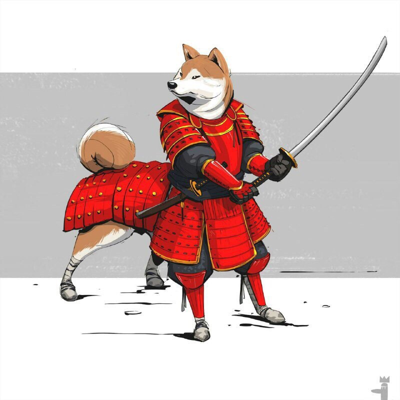

# Инструкция для работы с Markdown

## Выделение текста

 Чтобы выделить текст курсивом, необходимо обрамить его звездочками (*) или (_). Например, *вот так* или _вот так_

 Чтобы выделить текс полужирным необходимо обрамить его двойными звездочками (**) или (__). Например, **вот так** или __вот так__
 
Альтернативные способы выделения текста жирным или курсивом нужны для того, чтобы мы могли совмещать оба этих способа. Например, _текст может быть выделен курсивом и при этом быть **полужирным**_.

## Списки

    Чтобы добавить не нумерованные списки, необходимо пункты выделить звездочкой (*) или знаком (+), вот так:
    * Элемент 1
    * Эдемент 2
    * Элемент 3
    + Элемент 4

    Чтобы добавить нумерованные списки, необходимо пункты просто пронумеровать, вот так:
    1. Элемент 1
    2. Элемент 2
    3. Элемент 3

## Работа с изображениями

    Чтобы вставить изображение в текст, достаточно написать следуйщее:

## Ссылки

## Работа с таблицами

Чтобы рабоать с таблицами, нужно:

## Цитаты

## Заключение